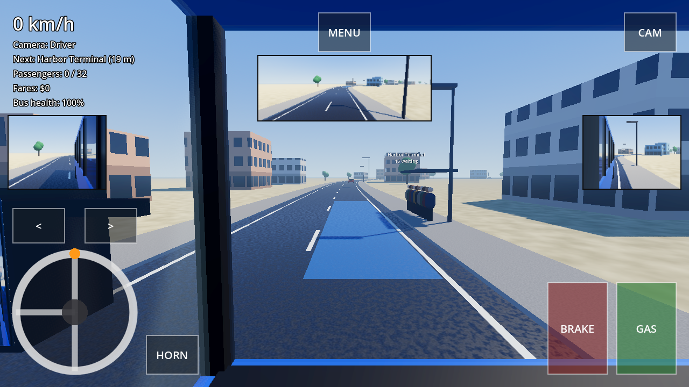
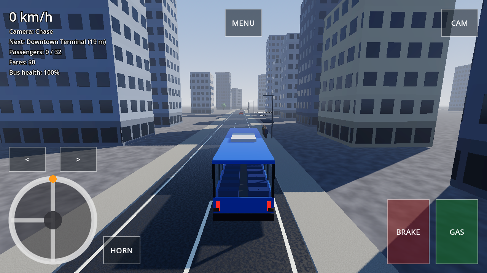
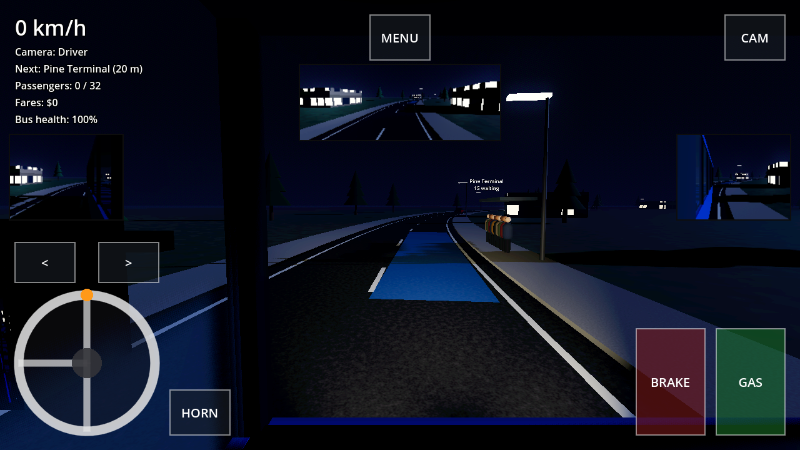

# Bus Simulator

Offline 3D bus-driving simulator for Android, built with **Godot 4.4**.
Drive metro-style routes, carry passengers, earn fares, and spend them on bigger
buses, upgrades and paint jobs. Careless driving costs you in repairs.

The full design lives in [docs/game-design.md](docs/game-design.md).

| Driver's seat | Downtown | Pine Hills by night |
|---|---|---|
|  |  |  |

## Install on your Android phone

1. On the phone, open the **[latest release](https://github.com/Umer-Iftikhar/bus-simulator/releases/latest)**
   in your browser (no GitHub account needed).
2. Under **Assets**, tap `bus-simulator-<version>-debug.apk` to download it.
3. Open the downloaded file. When asked, allow your browser / Files app to
   **install unknown apps**, then tap **Install** (if Play Protect warns, choose
   **More details → Install anyway**).
4. Open **Bus Simulator** and rotate the phone to landscape.

Requires Android 7.0+ (32- or 64-bit ARM phones); no internet needed to play. Full guide
with USB/ADB install, updating and troubleshooting:
**[docs/install-android.md](docs/install-android.md)**.

## Features

* **Driving** — procedural `VehicleBody3D` buses with a realistic drivetrain
  (D/R gearbox, top-speed fade, smooth speed-sensitive steering), keyboard
  support, horn, chase / driver (with a working dashboard) / top-down cameras.
* **Realistic touch controls** — a leather steering wheel with spokes and an
  airbag hub, a tall accelerator and wide ribbed brake pedal that sink when
  pressed, arrow-shaped indicator stalks, a D/R gear gate and chrome round
  buttons for horn, camera, lights and pause.
* **Lights** — off / low beam / high beam, with a blue main-beam tell-tale on
  the dash; brake, reverse and cabin lights.
* **Indicators** — *Manual* (you signal) or *Automatic* (signals into stops,
  when pulling out and when changing lanes), chosen in the main menu.
* **Maps** — five real cities, 2.8–3.8 km loops: Islamabad, Washington D.C.,
  Rawalakot (mountains), Tokyo by night and New York City, with terrain,
  rivers and bridges, landmarks, pedestrians and parked cars. Stops are
  450–850 m apart, with a "Bus stop ahead" banner counting down the distance.
  Passengers board at one stop and ride to another; fares are paid at the end.
* **Economy** — 5 buses in 4 body styles (minibus, city, double decker,
  coach), 4 upgrade lines × 5 levels, paint, stripes, rims, window tint and
  roof colours, optional repairs. Balance is checked by tests.
* **Photo textures** — real CC0 asphalt, paving, brick, concrete, grass, dirt
  and rock from [ambientCG](https://ambientcg.com), shipped in 480 / 720 /
  1080 px and picked by the graphics setting (Low / Medium / High+).
* **Traffic** — lane-locked AI cars using the Intelligent Driver Model; they
  queue behind the bus and **give way when you signal** a lane change.
* **Damage** — hittable parts (front/rear/left/right panels, left/right
  mirrors); top speed drops with health, 0 health = wrecked; dents show per panel.
* **Mirrors** — functional low-res SubViewport mirrors (left, right, rear) with
  a battery-saver refresh mode; smashed mirrors crack and stop rendering.
* **Look** — see-through bus with a full interior (dashboard, wheel, seats,
  upper deck), ACES tone mapping, soft shadows, haze, textured roads,
  procedural building facades with lit windows at night, street lights,
  broadleaf and pine trees, detailed traffic cars. All procedural: no image assets.
* **Save** — local JSON in `user://`, atomic writes, defensive loading.

## Controls

| Action | Touch | Keyboard |
|---|---|---|
| Steer (two full turns each way) | drag the wheel round | A / D or ← / → |
| Accelerate / brake | GAS / BRAKE pedals | W / S or ↑ / ↓ |
| Indicators | arrow buttons | Q / E |
| Gear (Drive / Reverse, when stopped) | D/R gate | R |
| Lights (off → low → high beam) | headlamp button | L |
| Camera | camera button | C |
| Horn | horn button | H |
| Menu | pause button | Esc |

## Project layout

| Path | Contents |
|---|---|
| `src/` | Game code. Pure logic is written as `RefCounted` classes; nodes are thin wrappers around it. |
| `scenes/` | Entry scene (`main.tscn`). The world is built from code and data. |
| `tests/framework/` | Minimal GDScript test framework (`TestCase`) and headless runner. |
| `tests/helpers/` | Autopilot (drives through the player's input actions), game driver, fixtures. |
| `tests/unit/` | Pure-logic tests: no scene tree or physics required. |
| `tests/integration/` | Several real nodes working together in a live tree and physics world. |
| `tests/system/` | End-to-end: the real game is booted and played with simulated input. |
| `tools/` | `run_tests.sh`, `lint.sh`, `export_android.sh` (local + CI/CD), `screenshots.gd` (renders views). |
| `.github/workflows/` | CI (lint + test pyramid) and CD (Android APK export, releases). |

## Running tests locally

```bash
export GODOT=/path/to/Godot_v4.4-stable   # the editor binary
tools/run_tests.sh unit          # or: integration | system | all
tools/run_tests.sh unit --filter=wallet
```

The runner imports the project, runs headless with `--fixed-fps 60` (deterministic
physics, faster than real time), writes JUnit XML to `reports/`, and fails on any
assertion failure **or** any GDScript error printed during the run. System tests
use throwaway save files and never touch a real save.

Lint and formatting checks (requires `pip install "gdtoolkit==4.*"`):

```bash
tools/lint.sh
```

## CI/CD

* **CI** (`ci.yml`) runs on every branch push and pull request:
  `lint` and `unit` in parallel → `integration` → `system`.
  Each stage uploads its JUnit report and writes a summary to the job page.
* **CD** (`cd.yml`) runs on every push to `main` and on `v*` tags: the full CI
  pipeline, then a headless Android export (`tools/export_android.sh`). The APK
  is verified (v2-signed with the project key, arm64 + armv7, correct package/version, and **no INTERNET
  permission** since the game is fully offline) and uploaded as an artifact.
  Tags also publish a GitHub Release with the APK attached.

### Release signing

Without secrets, CD signs the APK with the committed debug key
(`tools/android/debug.keystore`), so every release installs over the previous
one as an update. To ship release-signed builds (e.g. for the Play Store),
add these repository secrets:

| Secret | Value |
|---|---|
| `ANDROID_KEYSTORE_BASE64` | `base64 -w0 release.keystore` |
| `ANDROID_KEYSTORE_ALIAS` | key alias |
| `ANDROID_KEYSTORE_PASSWORD` | keystore/key password |

## Workflow

Each feature is developed on its own branch, verified by CI, and merged into
`main` with a merge commit, following the build order in the design doc.
